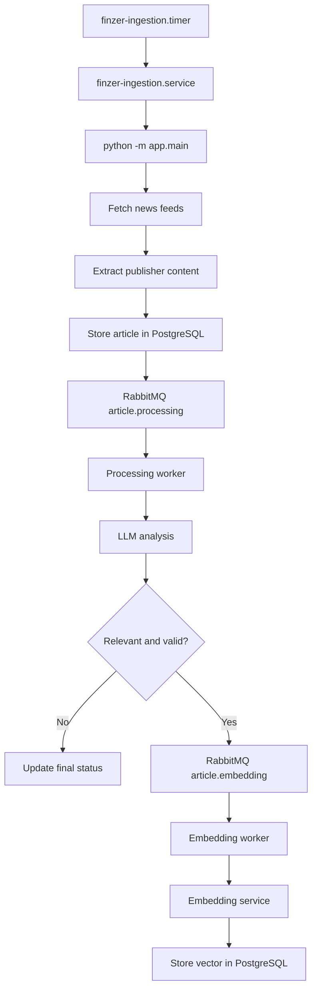
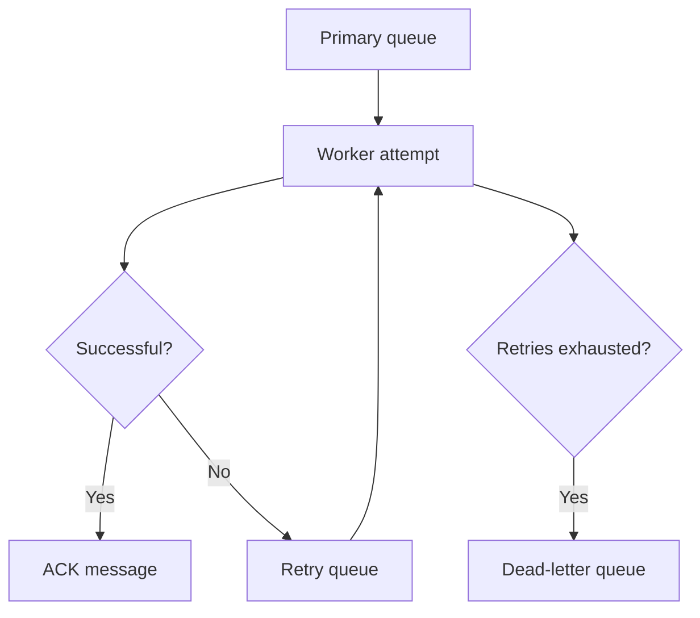
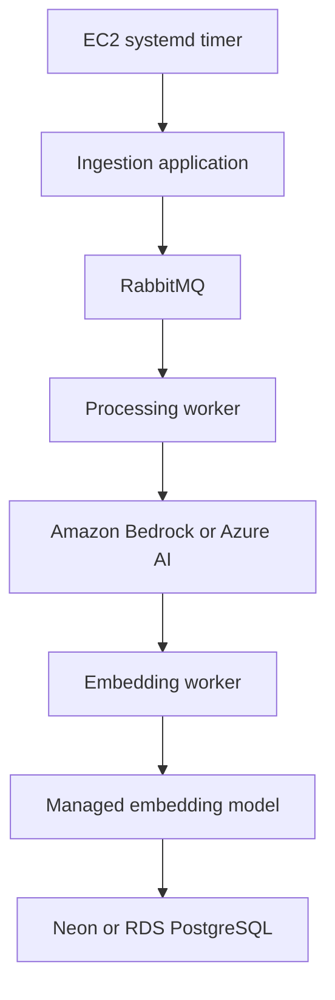

# Finzer AI — Ingestion Pipeline and Operations Guide

## 1. Purpose

This document describes:

- The Finzer news-ingestion architecture
- How articles flow through the application
- Which service and worker performs each task
- AWS EC2, RDS and RabbitMQ configuration
- systemd services and scheduling
- SSM, SSH and port-forwarding commands
- Monitoring and troubleshooting commands
- Retry queues and dead-letter queues
- Current known issues and future migration options

> Never store passwords, API keys, private keys or complete connection URLs in this document.

---

## 2. Current Infrastructure

| Component | Current implementation | Purpose |
|---|---|---|
| Ingestion server | AWS EC2 | Runs ingestion, workers and RabbitMQ |
| Scheduling | systemd timer | Starts ingestion every 12 hours |
| News ingestion | Python `app.main` | Fetches and stores new articles |
| Message broker | RabbitMQ | Transfers work between components |
| Processing worker | Python systemd service | Analyses article relevance |
| LLM | Self-hosted Qwen endpoint | Produces article analysis |
| Embedding worker | Python systemd service | Generates and stores embeddings |
| Embedding model | MiniLM endpoint | Generates 384-dimensional vectors |
| Database | Amazon RDS PostgreSQL | Stores articles and analysis |
| Vector storage | PostgreSQL `pgvector` | Stores and searches embeddings |
| Remote access | AWS SSM or SSH | Provides terminal access |
| Monitoring | systemd, journalctl and RabbitMQ CLI | Service and queue diagnostics |

### Important resource information

```text
AWS region:         us-east-1
Ingestion EC2:      i-08789ffc2c29b73fe
EC2 private IP:     172.31.94.191
Linux user:         ubuntu

Repository:         /home/ubuntu/Finzer-AI-Agent
Application:        /home/ubuntu/Finzer-AI-Agent/ingestion_service
Virtual environment:/home/ubuntu/Finzer-AI-Agent/venv

RabbitMQ vhost:     /finzer
Processing queue:   article.processing
Embedding queue:    article.embedding
```

---

## 3. End-to-End Article Flow



### Step-by-step explanation

1. `finzer-ingestion.timer` triggers ingestion every 12 hours.
2. The timer starts `finzer-ingestion.service`.
3. The service executes:

   ```bash
   python -m app.main
   ```

4. The ingestion application retrieves articles from configured feeds.
5. It attempts to fetch and extract the publisher’s full article content.
6. New or updated articles are written to PostgreSQL.
7. Articles requiring analysis are published to `article.processing`.
8. The processing worker consumes one article at a time.
9. It calls the configured LLM endpoint.
10. The LLM validates and analyses the article.
11. Invalid or irrelevant articles receive their appropriate database status.
12. Relevant articles are published to `article.embedding`.
13. The embedding worker generates a vector.
14. The vector is stored in PostgreSQL using `pgvector`.
15. The final article status becomes `embedded`.

---

## 4. Article Statuses

| Status | Meaning |
|---|---|
| `pending` | Article is waiting to be processed |
| `processing` | Processing worker has started the article |
| `analyzed` | LLM analysis completed |
| `irrelevant` | Article did not meet the relevance threshold |
| `invalid` | Article content or LLM result was invalid |
| `failed` | Processing failed |
| `embedded` | Analysis and embedding both completed |

---

## 5. RabbitMQ Queue Flow

### Primary queues

```text
article.processing
article.embedding
```

### Processing retry queues

```text
article.processing.retry.1
article.processing.retry.2
article.processing.retry.3
article.processing.dlq
```

### Embedding retry queues

```text
article.embedding.retry.1
article.embedding.retry.2
article.embedding.retry.3
article.embedding.dlq
```

### Retry behaviour



A successful message is acknowledged and removed.

A temporary failure is routed through retry queues with delays. After all configured retries are exhausted, the message is placed in the corresponding DLQ.

Do not purge a DLQ until the root cause is fixed and the messages are either replayed or intentionally discarded.

---

## 6. systemd Services

### Installed services

```text
finzer-ingestion.service
finzer-ingestion.timer
finzer-processing-worker.service
finzer-embedding-worker.service
```

### Responsibilities

| Unit | Type | Responsibility |
|---|---|---|
| `finzer-ingestion.service` | One-shot service | Executes one ingestion run and exits |
| `finzer-ingestion.timer` | Timer | Starts ingestion periodically |
| `finzer-processing-worker` | Permanent service | Consumes processing messages |
| `finzer-embedding-worker` | Permanent service | Consumes embedding messages |

### Enable services at boot

```bash
sudo systemctl enable --now finzer-ingestion.timer
sudo systemctl enable --now finzer-processing-worker
sudo systemctl enable --now finzer-embedding-worker
```

### Check whether services are enabled

```bash
sudo systemctl is-enabled finzer-ingestion.timer
sudo systemctl is-enabled finzer-processing-worker
sudo systemctl is-enabled finzer-embedding-worker
```

### Check whether services are running

```bash
sudo systemctl is-active finzer-ingestion.timer
sudo systemctl is-active finzer-processing-worker
sudo systemctl is-active finzer-embedding-worker
```

### Detailed status

```bash
sudo systemctl status finzer-ingestion.timer --no-pager -l
sudo systemctl status finzer-ingestion.service --no-pager -l
sudo systemctl status finzer-processing-worker --no-pager -l
sudo systemctl status finzer-embedding-worker --no-pager -l
```

### Stop the complete pipeline

Use this before database migration, configuration changes or model replacement:

```bash
sudo systemctl stop finzer-ingestion.timer
sudo systemctl stop finzer-processing-worker
sudo systemctl stop finzer-embedding-worker
```

### Restart workers

```bash
sudo systemctl restart finzer-processing-worker
sudo systemctl restart finzer-embedding-worker
```

### Manually trigger ingestion

```bash
sudo systemctl start finzer-ingestion.service
```

### Restart the timer

```bash
sudo systemctl restart finzer-ingestion.timer
```

### Show the next scheduled ingestion

```bash
systemctl list-timers --all | grep finzer
```

### Reload changed systemd files

Run this after editing anything under `/etc/systemd/system/`:

```bash
sudo systemctl daemon-reload
```

Then restart the affected service:

```bash
sudo systemctl restart finzer-processing-worker
```

---

## 7. Viewing Logs

### Recent ingestion logs

```bash
sudo journalctl -u finzer-ingestion.service -n 200 --no-pager -l
```

### Follow ingestion logs live

```bash
sudo journalctl -u finzer-ingestion.service -f
```

### Processing-worker logs

```bash
sudo journalctl -u finzer-processing-worker -n 200 --no-pager -l
```

### Follow processing logs

```bash
sudo journalctl -u finzer-processing-worker -f
```

### Embedding-worker logs

```bash
sudo journalctl -u finzer-embedding-worker -n 200 --no-pager -l
```

### Follow embedding logs

```bash
sudo journalctl -u finzer-embedding-worker -f
```

### Logs from the current boot

```bash
sudo journalctl -b -u finzer-processing-worker --no-pager -l
```

---

## 8. Accessing EC2 Through AWS SSM

SSM is preferred when port 22 is unavailable or SSH security-group rules are inconvenient.

### Start an interactive SSM session from PowerShell

```powershell
aws ssm start-session `
  --target i-08789ffc2c29b73fe `
  --region us-east-1
```

An SSM session normally starts as `ssm-user`, not `ubuntu`.

Switch to the Ubuntu user:

```bash
sudo -iu ubuntu
```

Then enter the project:

```bash
cd /home/ubuntu/Finzer-AI-Agent/ingestion_service
```

Activate the virtual environment:

```bash
source /home/ubuntu/Finzer-AI-Agent/venv/bin/activate
```

### Run Python without activating the environment

```bash
cd /home/ubuntu/Finzer-AI-Agent/ingestion_service

/home/ubuntu/Finzer-AI-Agent/venv/bin/python \
  -m app.workers.article_processing_worker
```

Using only `python` from `ssm-user` may produce:

```text
python: not found
```

Use the absolute virtual-environment path or switch to `ubuntu`.

---

## 9. SSH Access

### Connect from PowerShell

```powershell
ssh -i "C:\path\to\finzer-llm-key.pem" ubuntu@EC2_PUBLIC_IP
```

Example structure:

```powershell
ssh -i `
  "C:\Users\<USER>\Finzer-AI-Agent\deployment\llm_model_service\finzer-llm-key.pem" `
  ubuntu@<CURRENT_PUBLIC_IP>
```

### When SSH times out

Possible causes include:

- The EC2 public IP changed
- The instance is stopped
- Port 22 is not open
- Your local public IP changed
- The security group contains an old IP
- The EC2 instance is in a private subnet
- Network ACL or route-table configuration blocks SSH

Check your current public IP:

```powershell
Invoke-RestMethod -Uri "https://api.ipify.org"
```

Check the instance’s current public IP:

```powershell
aws ec2 describe-instances `
  --instance-ids i-08789ffc2c29b73fe `
  --region us-east-1 `
  --query "Reservations[0].Instances[0].PublicIpAddress" `
  --output text
```

If SSH remains unavailable, use SSM.

---

## 10. SSM Port Forwarding

A port-forwarding session must remain open in its own terminal. Open a second PowerShell terminal to run clients or workers.

### Forward a port on the EC2 instance

Example for RabbitMQ:

```powershell
aws ssm start-session `
  --target i-08789ffc2c29b73fe `
  --document-name AWS-StartPortForwardingSession `
  --parameters "portNumber=5672,localPortNumber=5672" `
  --region us-east-1
```

The local application then connects to:

```text
127.0.0.1:5672
```

### Forward to a remote host through EC2

Use `AWS-StartPortForwardingSessionToRemoteHost` when EC2 acts as a jump host.

Example parameter file:

```json
{
  "host": [
    "DATABASE_OR_MODEL_PRIVATE_HOST"
  ],
  "portNumber": [
    "5432"
  ],
  "localPortNumber": [
    "5433"
  ]
}
```

Start the session:

```powershell
aws ssm start-session `
  --target i-08789ffc2c29b73fe `
  --document-name AWS-StartPortForwardingSessionToRemoteHost `
  --parameters file://ssm-postgres-params.json `
  --region us-east-1
```

This maps:

```text
Local 127.0.0.1:5433 → remote PostgreSQL host:5432
```

### Session Manager plugin error

If PowerShell reports:

```text
SessionManagerPlugin is not found
```

install the AWS Session Manager plugin, reopen PowerShell and verify:

```powershell
session-manager-plugin --version
```

---

## 11. Running Workers Manually

Normally, workers should run through systemd. Manual execution is useful only for testing.

```bash
cd /home/ubuntu/Finzer-AI-Agent/ingestion_service
source /home/ubuntu/Finzer-AI-Agent/venv/bin/activate
```

Processing worker:

```bash
python -m app.workers.article_processing_worker
```

Embedding worker:

```bash
python -m app.workers.article_embedding_worker
```

A module name must be exact. For example:

```text
article_processing_worke
```

is invalid because it is missing the final `r`.

### Check for manually running duplicate workers

```bash
pgrep -af "app.workers.article_"
```

Expected systemd-managed processes:

```text
python -m app.workers.article_processing_worker
python -m app.workers.article_embedding_worker
```

Check consumer counts in RabbitMQ before killing anything. More consumers than expected may indicate duplicate Windows or manually started workers.

---

## 12. RabbitMQ Operations

The active Finzer RabbitMQ virtual host is:

```text
/finzer
```

### List queues

```bash
sudo rabbitmqctl list_queues -p /finzer \
  name consumers messages_ready messages_unacknowledged
```

Do not use PowerShell backticks inside a Linux shell. Linux uses `\` for line continuation.

### Queue-column meanings

| Column | Meaning |
|---|---|
| `consumers` | Number of workers subscribed to the queue |
| `messages_ready` | Messages waiting for a worker |
| `messages_unacknowledged` | Messages currently being processed |

Healthy primary queues normally look like:

```text
article.processing   1   0   0
article.embedding    1   0   0
```

A queue can temporarily contain ready or unacknowledged messages while processing is active.

### List RabbitMQ connections

```bash
sudo rabbitmqctl list_connections \
  user vhost peer_host peer_port state
```

The workers should connect to `/finzer`.

### Inspect virtual hosts

```bash
sudo rabbitmqctl list_vhosts
```

### Avoid accidental use of `/`

Always specify:

```bash
-p /finzer
```

The `/` and `/finzer` virtual hosts contain separate queues.

---

## 13. Database Diagnostics

Enter the correct directory and environment first:

```bash
sudo -iu ubuntu
cd /home/ubuntu/Finzer-AI-Agent/ingestion_service
source /home/ubuntu/Finzer-AI-Agent/venv/bin/activate
```

### Count articles by status

```bash
python - <<'PY'
from app.repositories.database import PostgresDatabase

query = """
SELECT processing_status, COUNT(*)
FROM articles
GROUP BY processing_status
ORDER BY processing_status
"""

with PostgresDatabase().connect() as connection:
    with connection.cursor() as cursor:
        cursor.execute(query)
        for status, count in cursor.fetchall():
            print(f"{status}: {count}")
PY
```

### Show recently embedded articles

```bash
python - <<'PY'
from app.repositories.database import PostgresDatabase

query = """
SELECT
    article_id,
    title,
    source,
    published_at,
    processing_status,
    embedded_at
FROM articles
WHERE processing_status = 'embedded'
ORDER BY embedded_at DESC
LIMIT 20
"""

with PostgresDatabase().connect() as connection:
    with connection.cursor() as cursor:
        cursor.execute(query)
        rows = cursor.fetchall()

        print(f"Successfully embedded articles: {len(rows)}")
        print()

        for row in rows:
            print(f"ID:        {row[0]}")
            print(f"Title:     {row[1]}")
            print(f"Source:    {row[2]}")
            print(f"Published: {row[3]}")
            print(f"Status:    {row[4]}")
            print(f"Embedded:  {row[5]}")
            print("-" * 70)
PY
```

### Check articles embedded after EC2 worker deployment

```sql
SELECT article_id, title, source, embedded_at
FROM articles
WHERE embedded_at >= TIMESTAMPTZ '2026-09-14 07:38:45+00'
ORDER BY embedded_at DESC;
```

The database currently does not record which host processed each article. Execution location must therefore be inferred from timestamps and deployment logs.

---

## 14. Configuration

The application configuration is stored at:

```text
/home/ubuntu/Finzer-AI-Agent/ingestion_service/.env
```

Edit it with:

```bash
nano /home/ubuntu/Finzer-AI-Agent/ingestion_service/.env
```

Save in Nano:

```text
CTRL+O
Enter
CTRL+X
```

Important configuration categories:

```env
DATABASE_URL=<REDACTED>

RABBITMQ_URL=<REDACTED>
ARTICLE_QUEUE=article.processing
ARTICLE_EMBEDDING_QUEUE=article.embedding

LLM_BASE_URL=<MODEL_ENDPOINT>
LLM_MODEL=<MODEL_NAME>
ARTICLE_RELEVANCE_THRESHOLD=0.65

EMBEDDING_SERVICE_URL=<EMBEDDING_ENDPOINT>
EMBEDDING_MODEL=<MODEL_NAME>
EMBEDDING_DIMENSION=384

ARTICLE_RETRY_DELAYS_MS=30000,120000,600000
```

Do not add spaces around `=`:

```env
RABBITMQ_URL=amqp://...
```

Avoid:

```env
RABBITMQ_URL= amqp://...
```

After changing `.env`, restart the affected services:

```bash
sudo systemctl restart finzer-processing-worker
sudo systemctl restart finzer-embedding-worker
```

---

## 15. Known LLM Failure

The processing-worker logs showed:

```text
Connection refused: 172.31.5.163:8000
```

This means:

- RabbitMQ was working
- The processing worker was working
- The worker could consume messages
- The configured LLM server was not accepting connections

After retries were exhausted, approximately 93 messages were routed to:

```text
article.processing.dlq
```

This is expected retry/DLQ behaviour, not a RabbitMQ failure.

### Safe response

Stop ingestion and processing while the LLM is unavailable:

```bash
sudo systemctl stop finzer-ingestion.timer
sudo systemctl stop finzer-processing-worker
```

The embedding worker can remain active, although it will have no work until analysis succeeds.

Do not purge the processing DLQ.

### Recovery order

1. Restore or replace the LLM.
2. Test its endpoint directly.
3. Test one article.
4. Restart the processing worker.
5. Confirm successful analysis.
6. Replay DLQ messages.
7. Restart scheduled ingestion.

---

## 16. Ingestion Extraction Errors

Errors such as these are article-level failures:

```text
Publisher returned HTTP 403
```

```text
Sufficient article content could not be extracted
```

They do not necessarily mean the entire ingestion service failed.

Common causes:

- Publisher blocks automated clients
- Paywall
- JavaScript-rendered content
- SSL failure
- Empty or malformed page
- Unsupported language/layout

The ingestion service should log the failure and continue to the next article.

---

## 17. News API Rate Limiting

NewsData can return:

```text
HTTP 429 Too Many Requests
```

Recommended conservative configuration:

```env
MAX_PAGES_PER_FEED=1
MAX_ARTICLES_PER_FEED=10
```

The current timer runs twice daily. With approximately 26 feeds:

```text
26 feeds × 10 articles × 2 runs × 30 days
= 15,600 maximum article candidates per month
```

Deduplication should reduce the number actually analysed.

API keys must be redacted from exception messages and logs.

---

## 18. Stopping RDS from the AWS Console

Before stopping RDS:

```bash
sudo systemctl stop finzer-ingestion.timer
sudo systemctl stop finzer-processing-worker
sudo systemctl stop finzer-embedding-worker
```

Then:

1. Open AWS Console.
2. Select `us-east-1`.
3. Open **RDS**.
4. Select **Databases**.
5. Select `finzer-postgres`.
6. Choose **Actions**.
7. Select **Stop temporarily**.
8. Optionally create a safety snapshot.
9. Confirm the stop operation.

The state changes:

```text
Available → Stopping → Stopped
```

Important:

- Do not select **Delete**.
- RDS automatically restarts a temporarily stopped instance after seven days.
- Storage and backup charges may continue.
- The application cannot use the database while it is stopped.

---

## 19. Current Versus Proposed Services

### Currently deployed

```text
EC2 ingestion
systemd scheduling
RabbitMQ
Self-hosted Qwen LLM
Self-hosted MiniLM embeddings
RDS PostgreSQL
pgvector
```

### Not currently deployed

```text
Amazon EventBridge
Amazon Bedrock
Azure OpenAI
OpenAI API
Neon PostgreSQL
Amazon Aurora
```

These are possible replacements, not current components.

---

## 20. Proposed Cost-Optimized Architecture



Recommended migration order:

1. Keep EC2 ingestion, RabbitMQ and systemd.
2. Replace the failed LLM server with Bedrock or Azure AI.
3. Test 20–50 real financial articles.
4. Replay the processing DLQ.
5. Migrate embeddings only after analysis is stable.
6. Move RDS to Neon only after the model migration works.
7. Retain RDS temporarily as a rollback option.

Changing embedding providers also changes vector dimensions:

| Model | Vector dimension |
|---|---:|
| Existing MiniLM | 384 |
| Titan Text Embeddings V2 | 1,024, 512 or 256 |
| OpenAI embedding models | Configurable/model-dependent |

The database column, generated vectors and query vectors must always use the same dimension and embedding model.

---

## 21. Routine Health Check

Run these commands after deployment or configuration changes:

```bash
sudo systemctl is-active finzer-ingestion.timer
sudo systemctl is-active finzer-processing-worker
sudo systemctl is-active finzer-embedding-worker
```

```bash
systemctl list-timers --all | grep finzer
```

```bash
sudo rabbitmqctl list_queues -p /finzer \
  name consumers messages_ready messages_unacknowledged
```

```bash
sudo journalctl -u finzer-processing-worker -n 50 --no-pager -l
```

```bash
sudo journalctl -u finzer-embedding-worker -n 50 --no-pager -l
```

A healthy system should have:

- Active timer
- One processing consumer
- One embedding consumer
- Queue counts that decrease over time
- No continuously growing retry queues
- No unexpected DLQ growth
- Database statuses progressing toward `embedded`, `irrelevant` or `invalid`

---

## 22. Security Checklist

- Never commit `.env`.
- Never commit `.pem` private keys.
- Rotate credentials exposed in terminal screenshots or chat.
- Store production secrets in AWS Systems Manager Parameter Store or Secrets Manager.
- Prefer IAM roles over static AWS access keys.
- Restrict RabbitMQ access to required hosts.
- Restrict PostgreSQL access to required sources.
- Use TLS for external PostgreSQL connections.
- Do not expose model endpoints publicly unless necessary.
- Add AWS budgets and billing alerts.
- Redact API keys from logs and exception URLs.

---

## 23. Quick Command Reference

### Enter application environment

```bash
sudo -iu ubuntu
cd /home/ubuntu/Finzer-AI-Agent/ingestion_service
source /home/ubuntu/Finzer-AI-Agent/venv/bin/activate
```

### Start everything

```bash
sudo systemctl enable --now finzer-ingestion.timer
sudo systemctl enable --now finzer-processing-worker
sudo systemctl enable --now finzer-embedding-worker
```

### Stop everything

```bash
sudo systemctl stop finzer-ingestion.timer
sudo systemctl stop finzer-processing-worker
sudo systemctl stop finzer-embedding-worker
```

### Restart workers

```bash
sudo systemctl restart finzer-processing-worker
sudo systemctl restart finzer-embedding-worker
```

### Trigger ingestion now

```bash
sudo systemctl start finzer-ingestion.service
```

### View timer schedule

```bash
systemctl list-timers --all | grep finzer
```

### Check queues

```bash
sudo rabbitmqctl list_queues -p /finzer \
  name consumers messages_ready messages_unacknowledged
```

### Follow processing logs

```bash
sudo journalctl -u finzer-processing-worker -f
```

### Follow embedding logs

```bash
sudo journalctl -u finzer-embedding-worker -f
```

### Interactive SSM session

```powershell
aws ssm start-session `
  --target i-08789ffc2c29b73fe `
  --region us-east-1
```

### SSH structure

```powershell
ssh -i "C:\path\to\private-key.pem" ubuntu@<CURRENT_PUBLIC_IP>
```

---

## 24. Current Operational Summary

At the time this document was prepared:

- Ingestion scheduling was configured and enabled.
- Processing and embedding workers were configured as systemd services.
- RabbitMQ and `/finzer` queues were operational.
- Retry and DLQ routing were operational.
- RDS PostgreSQL and `pgvector` were operational.
- Seven articles had previously reached `embedded`.
- The latest processing backlog exhausted retries because the LLM endpoint refused connections.
- Approximately 93 processing messages were preserved in the DLQ.
- Those messages must not be deleted before the replacement LLM is tested.
- Bedrock, Azure AI and Neon were being evaluated as managed replacements.